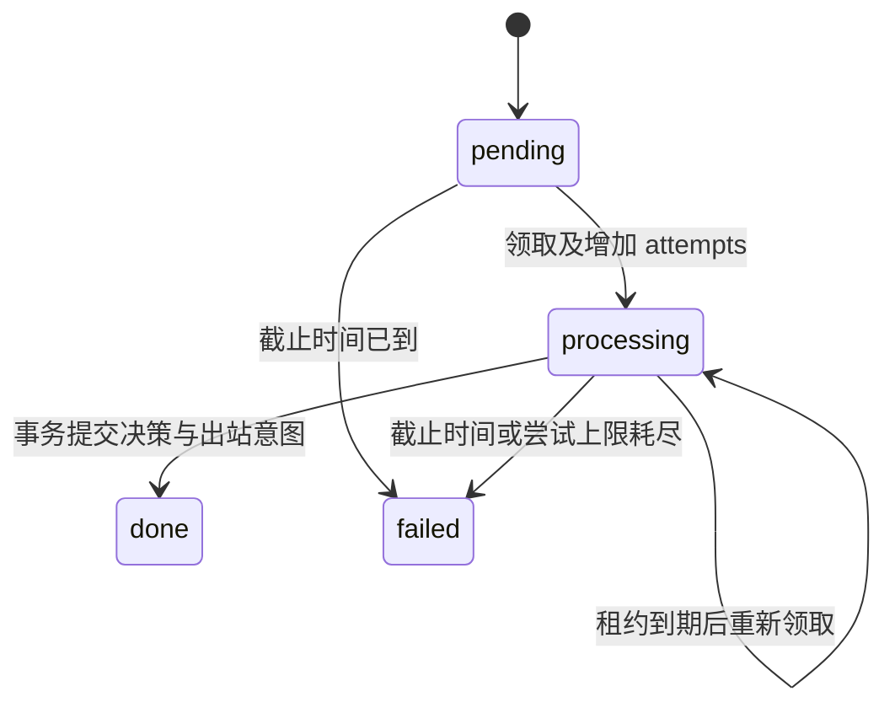

# 架构与当前实现

处理链路为：平台适配 → 持久事件与活动 → 核心决策 → 持久出站 → 平台。
当前实现数据契约、存储原语及配置驱动的单实例异步运行链。
反向 WebSocket、有预算约束的 HTTP 模型入口、人格决策和聊天运行命令已实现；
完整应用已通过合成模型及测试协议端上的 HTTP/WebSocket 故障演练，并完成测试协议端与真实模型的
最小文本往返；真实聊天平台兼容性、服务商账单核对、人格人工评审及候选观察尚待完成。

## 运行配置

`config.py` 从显式 TOML 读取专用会话白名单、人格审核版本、可信关系、模型限制与日/月预算。
凭据只从指定环境变量读取；`check-config` 不连接外部服务或创建运行数据，不输出凭据及配置原文。
无效字段、空白名单、越界关系、缺失凭据或不足以覆盖模型超时的租约均会拒绝加载。
当前仅允许 loopback OneBot 监听，主动活动保持关闭；混合响应模式仅接受白名单私聊与定向群文本。
配置检查验证本地配置结构；协议端、模型与费用估算需分别验证。

## OneBot 文本接入

`adapters/onebot.py` 使用 NoneBot2 / OneBot V11 SDK，将已授权账号、好友私聊与明确提及机器人的
群文本转换为平台无关事件。群聊使用群号命名空间，不与同用户的私聊混淆。
连接身份和事件账号均须匹配配置；临时会话、匿名消息、其他账号、非白名单及未定向群消息不会入库。
专用 `OneBotAdapter` 在 SDK 的 Bot 预处理之前执行准入，拒绝的引用消息不会触发 `get_msg` 查询。
从 SDK 保存的原始消息段判断提及，避免 SDK 移除 at 段后丢失定向证据。
图片、引用、文件等未支持消息段整条拒绝，不通过删除这些段制造不完整的文本请求。

入库事务完成后才触发 worker 唤醒。重复事件使用同一平台键，保留第一次入库的截止时间与累计尝试；
唤醒丢失不会删除 SQLite 中的工作，worker 每 0.5 秒检查持久待办。
反向 WebSocket 在接受连接前核对 Bearer token、配置账号及 `X-Client-Role: Universal`，
只允许一条活动连接；事件账号再次核对。未实现鉴权方案的 HTTP 上报入口明确返回 405。

`gateway.py` 直接构造独立 Driver 和显式配置，不调用会读取 `.env` 的 NoneBot 全局初始化。
配置源与 OneBot 构造器的兼容层由锁定 SDK 版本和独立进程的真实 WebSocket 测试覆盖；升级 SDK 时须重验。
当前没有加载外部插件。已验证实际 SDK 发送 API、回执相关性、断线重连及鉴权，
这些检查不表示真实模型或第三方协议端已经联调完成。

## 单实例生命周期

`InstanceLock` 使用 Windows 字节锁 / POSIX flock，先独占本地数据目录，再打开 SQLite 与恢复投递。
锁由进程持有，崩溃后操作系统释放；锁文件保留，不能靠删除文件或 PID 猜测强行接管。
同一数据目录的第二实例在接触数据库和恢复 `sending` 前失败。当前不支持共享网络盘或多机部署。

`Runtime` 创建唯一 worker 和 sender。worker 仅领取配置 agent 的活动，并再次检查当前会话授权；
一个超时范围覆盖完整决策及其内部重试，结束时间早于持久租约与原始截止时间。
超时/可重试失败保持累计尝试和原租约，永久拒绝记录 failed；取消后即使决策函数返回，也不得提交。
sender 在协议端在线时领取出站，并重新检查授权；达到投递截止时间的 pending 意图进入 failed。
明确的协议端拒绝进入 failed，限流响应把意图按服务端等待时间放回 pending；超时、取消或不确定异常记录 unknown。
任一后台任务意外终止会关闭接入并使网关退出，不能留下表面在线但停止处理的服务。
接入处理器显式向 runtime 报告持久入库失败，避免异常被 NoneBot 的 matcher 分派层捕获后继续丢失入站。

启动按锁 → 数据库/恢复 → worker/sender → 接入执行。正常停止先关闭监听及连接，随后关闭入库 gate、
取消并等待 worker/sender，再清理 SDK 事件任务，最后关闭数据库并释放锁。
SQLite 全部在同一事件循环线程使用，网络等待不持有事务；决策等待与发送等待期间仍可收包入库。
模型与发送函数必须遵守异步取消和有界请求契约；HTTP 模型入口与 OneBot 发送已接入该生命周期。

应用级测试使用实际 HTTP 客户端和 OneBot WebSocket，覆盖模型及回执等待期间入库、重推去重、
日/月预算拒绝、审计持久化故障退出、回执丢失后进程重启，以及进程直接崩溃后的恢复。
崩溃恢复检查原截止时间与累计尝试不变、旧模型预留不释放、新尝试使用新 ID；
回执丢失检查未知投递不会因重推再次发送。这些测试使用合成模型回答及用量，不代表真实服务验收。

## 事件身份

`SessionRef` 包含 platform、bot_id、kind、chat_id、thread_id。
`key` 使用 JSON 元组编码，避免原生 ID 含冒号等分隔符时碰撞。

`EventEnvelope.event_id` 标识本地保存的事件；`trace_id` 标识一次接入追踪；
`source_event_id` 由适配器提供，重推时必须稳定。去重域包含角色、完整会话、事件类型和平台事件标识。
编辑事件须含稳定的修订标识；撤回与原消息独立存储。入库重推返回原 event_id，保留原截止时间和尝试上限。
当前只支持文本消息段，图片、附件、平台回调等在接入时按真实需求扩展。

## 活动与投递

SQLite 使用 WAL、foreign_keys 和 synchronous=FULL。每个存储实例拥有一条连接，不跨线程共享连接。
写操作使用短 `BEGIN IMMEDIATE` 事务，网络操作不得置于事务内。
当前 schema 为 3；打开 schema 1 时先为 outbox 补充截止时间、尝试次数、下一次尝试时间和安全错误码，
再迁移至 schema 3；schema 2 只新增模型尝试审计表。各次迁移均在事务中更新版本，失败回滚。
已有事件、投递和预算账目保持不变，旧账目不补造缺失的用量或结果记录。其他版本拒绝打开。

同一 agent 只能同时领取一个活动。每次领取生成新 token，提交时检查 token、租约与截止时间。
这阻止过期 worker 提交，但不会取消已经发出的外部请求；未来模型层需同样处理在途用量。
当前 lease 固定长度；运行配置要求模型单次超时至少小于租约五秒，worker 还对整个决策设总时限。
没有续租协议，所有异步外部尝试须在本次领取的剩余时间内完成。

`complete` 将 inbox 标为 done 与创建 outbox 放在同一事务中，并复制活动截止时间。
reply=None 表示看过但不发言。当前一项活动至多产生一条文本出站消息。
`claim_delivery` 只领取未过截止时间且已到 `next_attempt_at` 的 pending 意图，把它改成 sending
并增加持久 attempts，再由适配器执行发送。收到回执才标记 sent；明确拒绝进入 failed；
限流等待保留原意图、尝试次数和截止时间。发送超时或专属 sender 启动时发现遗留 sending，转为 unknown。
unknown 不会被自动再次领取；可用可信平台回执或 `ginko reconcile-delivery` 人工标记 sent/failed。
查询命令只输出投递元数据，不输出消息正文。它不提供端到端恰好一次保证。

`recover_interrupted_deliveries` 只能由取得数据目录独占锁的 runtime 在启动时调用。
单机服务锁不等于多机 sender 领导者选举，不支持多实例部署。

## 记忆受众

当前实现 `MemoryAudience` 策略与 `MemoryFact` 契约，还没有事实存储、账户绑定服务或向量检索。

- session：仅原始会话可见。
- shared：原始会话与明确授权的目标会话可见。
- public：同一 agent 的会话均可见，仅用于获准公开的知识。

真实用户身份映射与受众授权是两回事。即使能确认两个账号是同一个人，也不能跳过共享授权。
派生记忆需逐次解析来源当前权限，所有来源均允许目标会话时才可检索；撤销授权不能被旧摘要绕过。
记忆存储上线后必须在查询层调用策略，且写入授权来自可信应用配置，不能消费 LLM 自报的权限。
source_event_ids 保存证据依赖；confidence 与 importance 分开，反思不能凭重要度覆盖原始事实。

## 费用

`BudgetLedger` 以整数 micro-USD 记账（1 USD = 1,000,000 micro-USD）。日/月周期均按 UTC，
费用归属请求开始时的周期。一个 operation_id 对应一次外部付费尝试，不能重复预留后再调用。
聊天、抽取、评审、状态演化、重试和工具都共享账本，由 purpose 标识类别。

调用前预留最坏费用；实际用量明确后结算；确认未发起外部请求才可取消预留。
结果未知时保持 reserved，重启不释放；下一次尝试使用新 ID 和新预留。
发生超出预留的实际支出时，先记录支出再抛 BudgetOverrunError，后续额度检查能看到真实账单。
预算上限由维护者配置，不能把 BudgetLimits 构造权限或账本写权限交给 Agent。

模型调用同时持久化 `model_attempts`：trace_id、operation_id、预留/结算状态、token 总计、
服务明确返回的缓存命中和推理子计数、费用、结果码及时间。预留与建档、费用与用量更新均使用同一事务；
重复结算只能提供相同证据，已记录的调用结果不能覆盖。审计不存储提示词、回答或服务端错误正文。
`ginko model-attempts <database>` 支持单个 operation_id 或 `--trace-id` 查询。

审计状态与预算状态分开：已知失败或取消但用量不明时，审计为 `unknown`、预算仍为 `reserved`；
只有确认请求未开始的取消才会释放预算。打开数据库或查询不会修改在途尝试。
runtime 取得数据目录独占锁后，把遗留 `reserved` 尝试标记为 `unknown/interrupted`；
已结算但尚无响应检查结果的尝试保留费用和用量，结果记为 `interrupted`。已有结果不变。
该恢复不释放预算。审计写入故障向上传播，由 runtime 停止接入并退出。
`accepted` 只代表模型入口接受响应，不代表业务决策有效或平台发送成功。

`providers/chat.py` 是非流式 Chat Completions 的统一入口。一条 HTTP 请求对应一次预留，
operation_id 包含入站 trace_id 和独立尝试 UUID；HTTP 客户端不自动重试或跟随重定向。
重试由上层活动决定，新尝试必须重新预留，历史 unknown 用量继续占用额度。
请求指定 `n=1`、`stream=false` 与输出 token 上限；HTTP 各阶段及整个请求均有超时，响应体限制为 1 MB。
非预期 SSE、编码、过大/不完整响应、取消或无合法用量时保持 reserved；HTTP 错误也不推定费用为零。

响应使用服务返回的输入、输出和总 token 计数，严格检查整数、正输入量、非负输出量及合计一致性，
拒绝全零用量以及与总数矛盾的推理/缓存子计数。
先按配置费率结算，再检查拒绝、空回答、截断、角色和内容结构；下游业务校验失败不能抹掉已经发生的费用。
缓存命中数只有在 usage 字段通过一致性校验且配置了已核对的缓存费率时才按缓存费率结算；
缺少命中明细时按完整输入费率计算。输出包括推理 token，结算是本地保守费用核算，
不等同于服务商原始账单；代理可能估算并补写 usage，需要在真实验收中与该次账单核对。
服务返回超出配置上限的 token 时，仍先记录费用，再停止服务供维护者核对。

输入准入采用 UTF-8 字节数与每条消息的模板余量，为 byte tokenizer 留保守上界；
它不是任意模型的通用 tokenizer。实际提供方必须验证模板、计费字段和输出上限包含推理 token 的契约。
预留使用配置的完整输入/输出上限，不能把示例费率或公开模型列表当作账户报价。
每个部署需核对所用账户的价格、用量字段与 token 上限。
流式生成、软阈值降频及自动用量核对尚未实现，当前不启用这些能力。

## 人格

包内包含吟子的身份、风格与静态背景三个文本文件，以及记录版本和审核策略的 manifest，运行时只读。
关系称呼由后续可信关系配置注入；默认不把所有用户认作花帆。
人格变更经维护者审核并更新 manifest 版本，聊天和普通记忆更新无权修改。
资源职责见 [人格资源说明](persona/README.md)，许可范围见 [许可与来源](licensing.md)。

## 构建产物

sdist 与 wheel 采用显式文件范围。两者都包含运行时 Python 代码与四份人格资源；源码包另含
锁文件、测试、验包脚本和公共工程文档。原始来源资料、凭据、聊天记录和运行数据不进入产物。

`scripts/verify_release.py` 校验包内清单、版本与源码一致性，记录产物 SHA-256，再从源码目录外
建立独立虚拟环境，仅安装锁定的生产依赖和 wheel，检查实际导入位置并运行离线命令。
这验证安装产物完整性，不等于平台接入、人格实机评测或正式发布。

## 下一条可运行链路

下一阶段继续核对真实模型的费用和边界契约，完成人格人工评审、候选运行观察及真实聊天平台兼容性验证。
随后再用第二平台的实际事件检查接口。
定时器只产生持久活动；概率社交、自动学习与自我演化在基本可靠性验证完成后开启。
