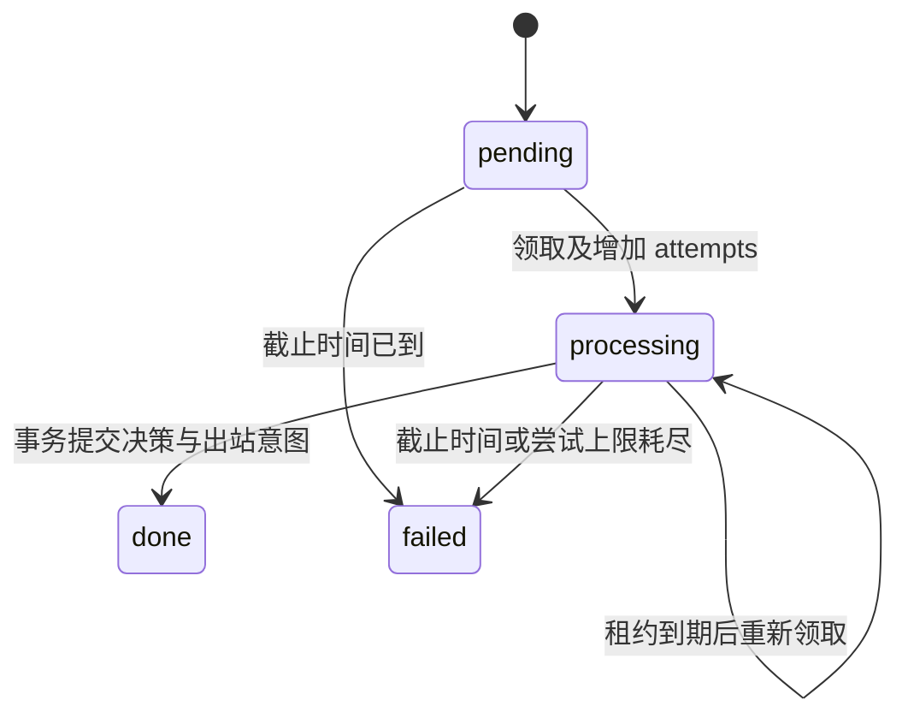

# 架构与当前实现

处理链路为：平台适配 → 持久事件与活动 → 核心决策 → 持久出站 → 平台。
首批代码实现数据契约与存储原语，暂不启动常驻 worker，也不连接真实平台或模型。

## 事件身份

`SessionRef` 包含 platform、bot_id、kind、chat_id、thread_id。
`key` 使用 JSON 元组编码，避免原生 ID 含冒号等分隔符时碰撞。

`EventEnvelope.event_id` 标识本地保存的事件；`trace_id` 标识一次接入追踪；
`source_event_id` 由适配器提供，重推时必须稳定。去重域包含角色、完整会话、事件类型和平台事件标识。
编辑事件须含稳定的修订标识；撤回与原消息独立存储。入库重推返回原 event_id，保留原截止时间和尝试上限。
当前只支持文本消息段，图片、附件、平台回调等在接入时按真实需求扩展。

## 活动与投递

SQLite 使用 WAL、foreign_keys 和 synchronous=FULL。每个存储实例拥有一条连接，不跨线程共享连接。
写操作使用短 `BEGIN IMMEDIATE` 事务，网络操作不得置于事务内。

同一 agent 只能同时领取一个活动。每次领取生成新 token，提交时检查 token、租约与截止时间。
这阻止过期 worker 提交，但不会取消已经发出的外部请求；未来模型层需同样处理在途用量。
当前 lease 固定长度，后续常驻 worker 需选择有界请求超时，或实现显式续租协议。

`complete` 将 inbox 标为 done 与创建 outbox 放在同一事务中。reply=None 表示看过但不发言。
当前一项活动至多产生一条文本出站消息。`claim_delivery` 把 pending 改成 sending，再由适配器执行发送。
收到回执才标记 sent；发送超时或专属 sender 启动时发现遗留 sending，转为 unknown。
unknown 不会被自动再次领取，可用可信平台回执确认送达。下一阶段再增加永久失败、限流等待、
主动消息过期和人工核对工具。它不提供端到端恰好一次保证。

`recover_interrupted_deliveries` 只能由独占 sender 在启动时调用。当前没有实现多进程 sender
领导者选举或服务级单实例锁；不要把这个存储原语当作可直接多实例部署的服务。

## 记忆受众

当前实现 `MemoryAudience` 策略与 `MemoryFact` 契约，还没有事实存储、账户绑定服务或向量检索。

- session：仅原始会话可见。
- shared：原始会话与明确授权的目标会话可见。
- public：同一 agent 的会话均可见，仅用于获准公开的知识。

真实用户身份映射与受众授权是两回事。即使能确认两个账号是同一个人，也不能跳过共享授权。
派生记忆需逐次解析来源当前权限，所有来源均允许目标会话时才可检索；撤销授权不能被旧摘要绕过。
记忆存储上线后必须在查询层调用策略，且写入授权来自可信应用配置，不能消费 LLM 自报的权限。
source_event_ids 保存证据依赖；confidence 与 importance 分开，反思不能凭重要度覆盖原始事实。

## 费用

`BudgetLedger` 以整数 micro-USD 记账（1 USD = 1,000,000 micro-USD）。日/月周期均按 UTC，
费用归属请求开始时的周期。一个 operation_id 对应一次外部付费尝试，不能重复预留后再调用。
聊天、抽取、评审、状态演化、重试和工具都共享账本，由 purpose 标识类别。

调用前预留最坏费用；实际用量明确后结算；确认未发起外部请求才可取消预留。
结果未知时保持 reserved，重启不释放；下一次尝试使用新 ID 和新预留。
发生超出预留的实际支出时，先记录支出再抛 BudgetOverrunError，后续额度检查能看到真实账单。
预算上限由维护者配置，不能把 BudgetLimits 构造权限或账本写权限交给 Agent。

账本只实现硬额度原语。模型价格表、最坏费用估算、流式中断用量核对、软阈值降频及统一 provider
执行入口尚未接入。新 provider 必须让每一次实际请求经过这个入口，不能把原语存在等同于调用已受控。

## 人格

包内包含吟子的身份、风格与静态背景三个文本文件，以及记录版本和审核策略的 manifest，运行时只读。
关系称呼由后续可信关系配置注入；默认不把所有用户认作花帆。
人格变更经维护者审核并更新 manifest 版本，聊天和普通记忆更新无权修改。
资源职责见 [人格资源说明](persona/README.md)，许可范围见 [许可与来源](licensing.md)。

## 0.1.0 交付检查

sdist 与 wheel 采用显式文件范围。两者都包含运行时 Python 代码与四份人格资源；源码包另含
锁文件、测试、验包脚本和公共工程文档。原始来源资料、凭据、聊天记录和运行数据不进入产物。

`scripts/verify_release.py` 校验包内清单、版本与源码一致性，记录产物 SHA-256，再从源码目录外
建立独立虚拟环境，仅安装锁定的生产依赖和 wheel，检查实际导入位置并运行离线命令。
这验证安装产物完整性，不等于平台接入、人格实机评测或正式发布；软件、人格和 schema 版本均不改变。

## 下一条可运行链路

下一阶段实现 NoneBot2/OneBot V11 薄适配、白名单、单 sender 生命周期与一个明确支持的模型端点，
补齐运行配置和核心 worker。先在一个专用测试会话验证文本应答，接着用第二平台的实际事件检查接口。
定时器只产生持久活动；概率社交、自动学习与自我演化在基本可靠性验证完成后开启。
